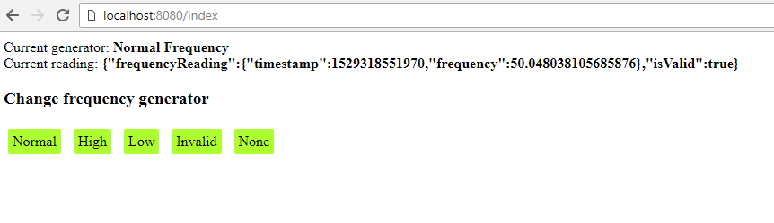

## Younicos test app

Application is devided on 2 parts frequency-generator and frequency-tracker. First, generates different
frequency reading, and second consumes them and generates Events based on them

Each application could be strated separatly using 

```mvn spring-boot:run```


### Frequency generation

On the frequency control page you can switch different frequency generator to simulate different events

```http://localhost:8080/index```



### Frequency tracking

Current events printed in console or you could export history of events using

```http://localhost:8092/export/csv```

